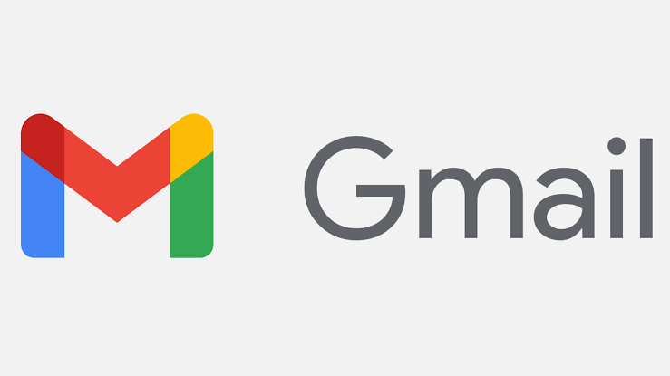
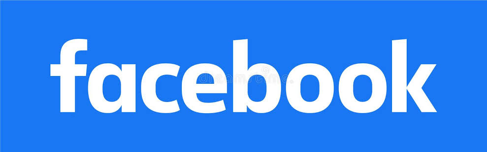
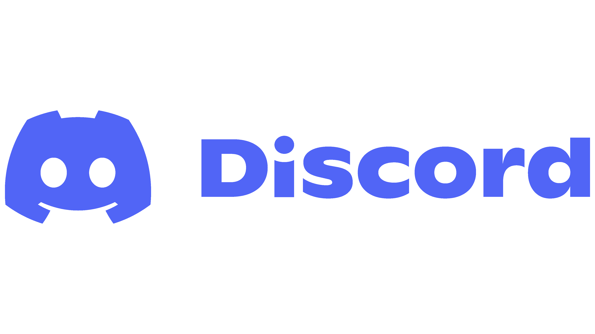

  

# Hello, World! I'm Aivy 
 
### BS Computer Science Student • Future Full-Stack Developer • Aspiring Data Scientist

---
## 👩‍💻 About Me
I'm a Computer Science student with a passion for software development and building applications that solve real-world problems. I enjoy transforming ideas into intuitive, functional, and engaging digital experiences while continuously expanding my knowledge of modern technologies.⚙️

I believe that every project is an opportunity to learn something new, refine my skills, and grow as a developer.👩

## 💻 Tech Stack

### Languages

  

---
### Tools & Technologies

  

## 📌 Featured Projects

### 💱 Currency Converter
A console-based application that performs accurate currency conversions with input validation and a simple user interface.

### ⌨️ Typing Adventure
An educational typing game where players improve their typing speed and accuracy by defeating enemies through correctly typed words.

## 🌱 Currently Learning
- 🌐Full-Stack Web Development
- 📊Data Structures & Algorithms
- 💻Object-Oriented Programming
- 🔍Data Science Fundamentals
- 🎰Machine Learning Basics
- 🐈‍⬛Git & Open Source Collaboration

## 🎯 Goals
- 🍎Develop software that creates meaningful impact
- 🏗️Build scalable and user-friendly applications
- 🧠Strengthen my knowledge of software engineering
- 🤖Explore artificial intelligence and data science
- 🏘️Contribute to open-source communities
- 📚Never stop learning and improving

---

🍋  "When life gives you lemonade, make lemons. Life will be all like, 'What?!'"    
~ Phil Dunphy

Thanks for visiting my profile! Feel free to explore my repositories and follow my journey as I continue learning, building, and growing as a developer. 💗

---
## 📱 Let's Connect

<a href="https://github.com/lalaaivy">

href="messageto:mydcaccount">

